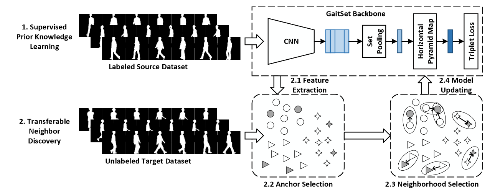

# Biometric
 Project for Biometric Authentication Course in HUST

### OULP
The data have been collected by since March 2009 through outreach activity events in Japan. The approved informed consent was obtained from all the subjects in this dataset. The data set consists of persons walking on the ground surrounded by the 2 cameras at 30 fps, 640 by 480 pixels. The datasets are basically distributed in a form of silhouette sequences registered and size-normalized to 88 by 128 pixels size.

### CASIA-B
 Dataset B is a large multiview gait database, which is created in January 2005. There are 124 subjects, and the gait data was captured from 11 views. Three variations, namely view angle, clothing and carrying condition changes, are separately considered. Besides the video files, we still provide human silhouettes extracted from video files. The detailed information about Dataset B and an evaluation framework can be found in this paper .
The format of the video filename in Dataset B is 'xxx-mm-nn-ttt.avi', where

    xxx: subject id, from 001 to 124.
    mm: walking status, can be 'nm' (normal), 'cl' (in a coat) or 'bg' (with a bag).
    nn: sequence number.
    ttt: view angle, can be '000', '018', ..., '180'.

In this project, we only focus on nm condition and the angle is 55 degree, which has been recognized as the most effective performance. 

### About model

Thanks to some outstanding researchers and I borrow some references, I give the TraND model which is the Transferable Neighrest Neighbors Discovery model 

>[!warning]
>Since the dataset too large, I cannot upload to github, so if you want to download the dataset, here is the link:   

